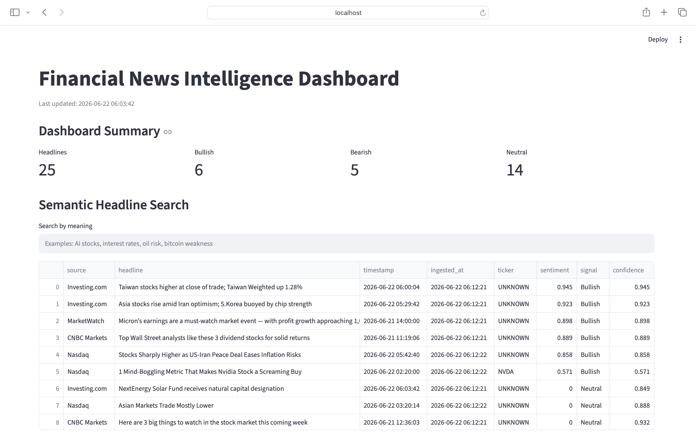

# Financial News Intelligence Dashboard

This project was built to explore how modern NLP techniques can be applied to financial news monitoring.

The system automatically collects headlines from multiple financial news sources, analyses sentiment using FinBERT, generates semantic embeddings with Sentence Transformers, and surfaces emerging themes through clustering and interactive visualisations.

The project was developed as a practical exercise in building an end-to-end AI pipeline rather than training a custom model. The focus was on data ingestion, NLP workflows, semantic search, automation and dashboard development.

## How to Run

pip install -r requirements.txt
python app/ingest.py
python app/analyse.py
python app/semantic_search.py
streamlit run app/dashboard.py

## Technical Highlights

- Aggregates news from MarketWatch, CNBC, Yahoo Finance, Nasdaq and Investing.com RSS feeds
- Filters and deduplicates market-relevant headlines
- Applies FinBERT sentiment classification to generate bullish, bearish and neutral signals
- Generates semantic embeddings using all-MiniLM-L6-v2
- Implements semantic headline search and related-headline recommendations
- Uses K-Means clustering to identify emerging market themes
- Tracks sentiment history across pipeline runs
- Presents results through an interactive Streamlit dashboard

## Project Structure

app/
- ingest.py
- analyse.py
- semantic_search.py
- dashboard.py
- scheduled_pipeline.py

data/
- news.csv
- analysed_news.csv
- sentiment_history.csv
- headline_embeddings.npy

## Author

Brock Fuller

Master of Artificial Intelligence – RMIT University
